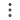
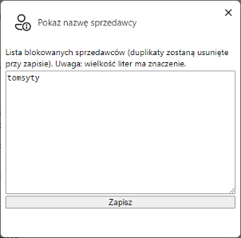
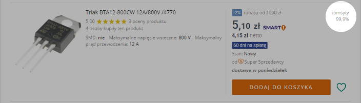
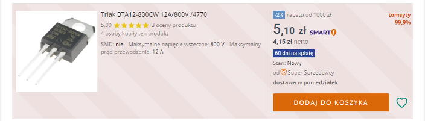

## Pokaż nazwę sprzedawcy na liście ofert
To rozszerzenie pozwala na wyświetlanie nazwy sprzedawcy oraz jego procentu poleceń bezpośrednio na liście ofert podczas przeglądania aukcji, bez konieczności najeżdżania myszką na miniaturkę. Oprócz tego pozwala na dodawanie sprzedawców do czarnej listy, dzięki czemu aukcje tych sprzedawców będą dodatkowo oznaczone na liście ofert i będzie można je łatwo pomijać.

Jest to rozszerzenie do przeglądarki Chrome. Wszystkie rozszerzenia testuję tylko dla systemu Windows 10 i najnowszej wersji przeglądarki.

**Instrukcja instalacji:**
1. Pobierz rozszerzenie "show_seller_name_on_listings_page.zip" z listy plików widocznej powyżej i rozpakuj je tam gdzie zamierzasz je trzymać.
2. Kliknij ikonę menu rozszerzeń w prawym górnym rogu okna przeglądarki (ikona puzzla)

lub z menu przeglądarki wybierz "Rozszerzenia - Zarządzaj rozszerzeniami".
3. Włącz "Tryb dewelopera" w prawym górnym rogu okna przeglądarki

4. Kliknij przycisk "Załaduj rozpakowane"
    
    

    Wybierz folder z uprzednio pobranym i rozpakowanym rozszerzeniem.
5. Jeśli chcesz dodać sprzedawców do czarnej listy, wybierz "Opcje" z menu  przy ikonie rozszerzenia. W wyskakującym oknie

    

    w polu tekstowym dodaj po jednej nazwie na każdy wiersz. Zwróć uwagę na wielkość liter - ma ona znaczenie. Najlepiej skopiuj i wklej nazwę sprzedawcy, zwróć przy tym uwagę czy we wklejonym tekście nie ma spacji na końcu. Pamiętaj żeby zapisać zmiany przyciskiem "Zapisz". Jeśli miałeś otwartą stronę z aukcjami, po zapisaniu odśwież ją aby wczytać dokonane zmiany.
6. Nazwy sprzedawców wyświetlać się będą w prawym górnym rogu wierszy z przedmiotami
    
    

7. Jeżeli sprzedawca jest na czarnej liście, wyświetlana nazwa będzie pogrubiona, na czerwono, a tło będzie prążkowane na delikatny różowy

    

***
Jeżeli napotkasz jakieś błędy w trakcie działania aplikacji, masz jakieś pytania, sugestie, problemy z obsługą, daj znać w sekcji "Discussions".
Jeżeli podoba Ci się moja praca i chcesz aby była dalej rozwijana, możesz wesprzeć mnie dotacją na dowolną kwotę przez PayPal (nie ma potrzeby posiadania konta PayPal): [przekaż donację](https://www.paypal.com/donate/?hosted_button_id=GVU3UC2ZY85SN&locale.x=pl_PL)
